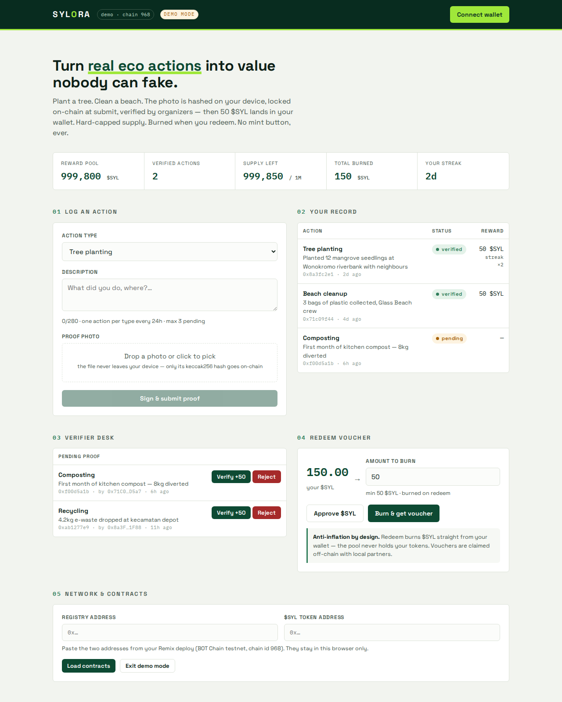

<div align="center">


# Sylora

**Eco-action rewards on BOT Chain**

Record real environmental actions, verify their proof, and reward approved contributions with a fixed-supply SYL token.

<br />

[](https://scan.botchain.ai/)
[](https://soliditylang.org/)
[](frontend/app.html)
[](frontend/vendor/ethers.umd.min.js)

<br />



<br />

[Live Demo](#live-demo) · [Features](#features) · [How It Works](#how-it-works) · [Smart Contract](#smart-contract)

</div>

---

## Problem

Environmental reward apps need a way to show that an action was reviewed and that rewards cannot be issued without limit. Photos can be swapped after submission, private point balances are hard to audit, and redemption often leaves no visible record of what happened to the points.

## Solution

**Sylora** sends an action description and photo to a verifier queue. The verifier approves or rejects the submission; the decision and photo hash are recorded on BOT Chain. Each approved submission receives **50 SYL** from a fixed reward pool. The token starts with a supply of **1,000,000 SYL** and has no mint function. Demo redemptions burn SYL and record the redemption on-chain.

## Vision

Make community climate action visible, verifiable, and accountable from submission to reward and redemption.

---

## Features

| | Feature | Description |
|:---:|---------|-------------|
| 🌱 | **Log eco-actions** | Submit tree planting, cleanup, recycling, composting, or another green action with a description and photo. |
| 🔍 | **Human verification** | A designated verifier sees the submitted photo and approves or rejects it. |
| 🪙 | **Fixed reward pool** | An approved action receives 50 SYL; all 1,000,000 SYL are allocated to the registry at deployment, with no mint function. |
| 📣 | **Social challenges** | Follow Sylora on X, engage with posts, or share a weekly eco post with a public link and screenshot for review. |
| 🔥 | **Burn on redemption** | Demo redemption burns SYL and records an on-chain event; usable vouchers are not available yet. |

---

## How It Works

<div align="center">

```
Participant ──submit address, action + photo──► shared queue
Verifier ──approve or reject (one transaction)──► BOT Chain
Approved action ──50 SYL from reward pool──► participant
Demo redemption ──burn SYL──► on-chain redemption record
```

</div>

### Gas model for the shared queue

| Action | Who pays | Design |
|--------|----------|--------|
| Submit action or challenge | Participant | No wallet connection, confirmation, signature, transaction, or gas fee |
| Approve or reject | Verifier | One transaction; approval transfers 50 SYL from the reward pool |
| Read actions and balances | Free | View calls require no transaction |
| Demo redemption | Participant | One registry call burns approved SYL after token allowance is granted |

### 1. Participant

- Browse the landing page and action list without connecting a wallet.
- Paste a BOT Mainnet wallet address to receive SYL. This does not connect or prompt the wallet.
- Describe the action and select a JPG or PNG photo (maximum 5 MB). Submit it directly in the app.
- Wait for the verifier to approve or reject the queued submission.
- Approval transfers 50 SYL directly from the reward pool to the participant's wallet. There is no separate withdrawal transaction. Use **Show SYL in wallet** in the app, or import the token contract address manually in the wallet if needed.
- Use the Challenges tab for Sylora promotion tasks. Like, comment, and repost are independent action types, so all three can be completed in one cycle and each receives its own 24-hour cooldown after approval.
- The queue allows one pending submission per action type. Daily engagement tasks and the weekly eco post can therefore wait for review at the same time.

### 2. Verifier

- Connect a wallet authorized as a verifier by the organiser.
- See queued submissions, including the photo and description, in the verifier desk.
- Click **Approve** or **Reject**. This is one transaction paid by the verifier wallet.

The shared queue requires a running Node server. Because the participant does not sign, the verifier is responsible for deciding whether the submitted wallet address and evidence are credible. The demo queue currently exposes uploaded photos to anyone who knows the photo URL; add authentication and private storage before using real personal photos in production.

Run `npm run compile` and `npm run test:queue` from `build-week` to verify the queue and review flow locally.

### 3. Organiser

- Deploy and configure the registry and token, then appoint verifier wallets.
- The production queue-review registry `0xA26FE9756D942A491385B542f6E60e1163C7a6a3` and token `0x9b289f77C099D7D7ed169fdd9c931266C9963dB3` are deployed and linked on BOT Mainnet. The previous BOT Testnet deployment remains listed below for reference, but its balances and queue data do not migrate to Mainnet.
- Monitor the reward pool and verification process.
- The current app checks one-time and weekly challenge limits from wallet history; the contract enforces a 24-hour cooldown for each individual action type, including each daily engagement task.

---

## Tech Stack

| Layer | Stack |
|-------|--------|
| **Smart Contract** | Solidity `0.8.20` · `EcoActionRegistry.sol` · `SylToken.sol` |
| **Frontend and queue** | HTML, CSS, and JavaScript · Node.js HTTP server · file-backed queue |
| **Wallet / Chain** | ethers.js v6 · MetaMask-compatible wallet · BOT Chain Mainnet `677` |
| **Development** | Node.js · solc · Anvil-based end-to-end tests |
| **Hosting** | Node.js server with persistent disk for queue and photos |

---

## Live Demo

<div align="center">

**Run Sylora locally**

</div>

Run from `build-week`:

```powershell
npm start
```

Open [the app](http://localhost:8080/app.html). The verified BOT Mainnet addresses are the defaults; `REGISTRY_ADDRESS` and `TOKEN_ADDRESS` can override them. A wallet is needed only for verifier review, balance display, token import, or redemption.

---

## Contract Addresses

### BOT Mainnet

Current verified deployment on BOT Mainnet, chain ID `677`:

| Network | Contract | Address |
|---------|----------|---------|
| **BOT Mainnet · 677** | EcoActionRegistry | `0xA26FE9756D942A491385B542f6E60e1163C7a6a3` |
| **BOT Mainnet · 677** | SylToken | `0x9b289f77C099D7D7ed169fdd9c931266C9963dB3` |

Explorer: [`scan.botchain.ai`](https://scan.botchain.ai)

### BOT Testnet

Current verified deployment on BOT Testnet, chain ID `968`:

| Network | Contract | Address |
|---------|----------|---------|
| **BOT Testnet · 968** | EcoActionRegistry | `0x78771952847B4FF95b597f9639aeC8E0D3EF6F47` |
| **BOT Testnet · 968** | SylToken | `0x942C734dD3c6a23794e65e16bB78f5A713891537` |

The app connects to `https://rpc.botchain.ai` for public reads. Contract source and deployment notes are in [`build-week/`](build-week/) and [`DEPLOY_NOTES.md`](build-week/DEPLOY_NOTES.md).

---

## Project Structure

```
sylora/
├── build-week/
│   ├── contracts/
│   │   ├── EcoActionRegistry.sol   # Action registry and rewards
│   │   └── SylToken.sol            # Fixed-supply SYL token
│   ├── server.js                   # Shared queue and frontend server
│   ├── test-queue.js               # Queue and contract integration test
│   ├── test-e2e.js                 # Contract end-to-end tests
│   └── DEPLOY_NOTES.md             # Deployment and test notes
├── frontend/
│   ├── assets/                     # Logo and mascot images
│   ├── vendor/                     # Bundled ethers.js
│   ├── index.html                  # Landing page
│   └── app.html                    # Wallet app
├── SYLORA_PRD.md
└── README.md
```

---

<div align="center">

**Sylora** — real climate actions, verifiable rewards on BOT Chain<br />
Made for GMT Build Week Vol. 2

</div>
